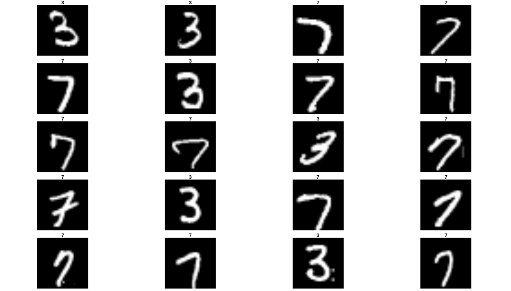
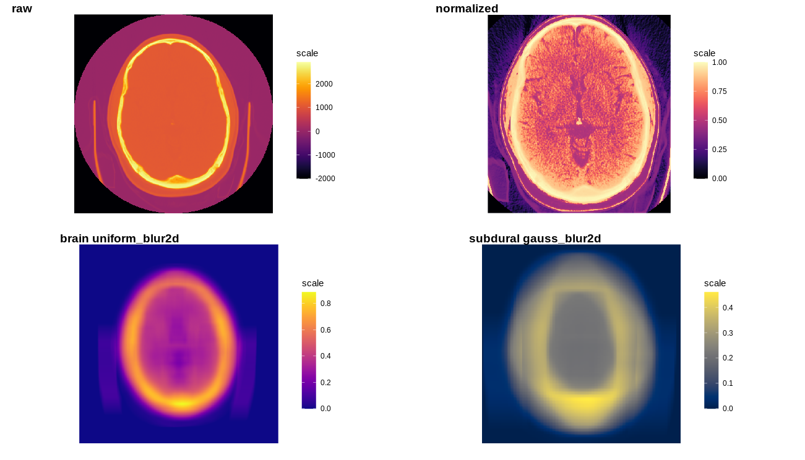

## R interface to fastai

The fastai package provides R wrappers to [fastai](https://github.com/fastai/fastai).

The fastai library simplifies training fast and accurate neural nets using modern best practices. See the fastai website to get started. The library is based on research into deep learning best practices undertaken at ```fast.ai```, and includes "out of the box" support for ```vision```, ```text```, ```tabular```, and ```collab``` (collaborative filtering) models. 

[](https://www.tidyverse.org/lifecycle/#experimental)

## Continuous Build Status

| Build      | Status |
| ---             | ---    |
| **Xenial**   | |
| **Bionic**   | |
| **Focal**   | |
| **Mac OS**   |  |
| **Windows**   | |

## Installation

Requirements:

- Python >= 3.6
- CPU or GPU

The dev version:

```
devtools::install_github('henry090/fastai')
```

Later, you need to install the python module fastai:

```
install_fastai(version = '2.0.0', gpu = FALSE, cuda_version = '10.1', overwrite = FALSE)
```

## Tabular data

```
library(magrittr)
library(fastai)

df = data.table::fread('https://github.com/henry090/fastai/raw/master/files/adult.csv')
```

Variables:

```
dep_var = 'salary'
cat_names = c('workclass', 'education', 'marital-status', 'occupation', 'relationship', 'race')
cont_names = c('age', 'fnlwgt', 'education-num')
```

Preprocess strategy:

```
procs = list(FillMissing(),Categorify(),Normalize())
```

Prepare:

```
dls = TabularDataTable(df, procs, cat_names, cont_names, 
      y_names="salary", splits = list(c(1:32000),c(32001:32561))) %>% 
      dataloaders(bs=64)
```

Summary:

```
model = dls %>% tabular_learner(layers=c(200,100), metrics=accuracy)
model %>% summary()
```

```
TabularModel (Input shape: ['64 x 7', '64 x 3'])
================================================================
Layer (type)         Output Shape         Param #    Trainable 
================================================================
Embedding            64 x 6               60         True      
________________________________________________________________
Embedding            64 x 8               136        True      
________________________________________________________________
Embedding            64 x 5               40         True      
________________________________________________________________
Embedding            64 x 8               136        True      
________________________________________________________________
Embedding            64 x 5               35         True      
________________________________________________________________
Embedding            64 x 4               24         True      
________________________________________________________________
Embedding            64 x 3               9          True      
________________________________________________________________
Dropout              64 x 39              0          False     
________________________________________________________________
BatchNorm1d          64 x 3               6          True      
________________________________________________________________
BatchNorm1d          64 x 42              84         True      
________________________________________________________________
Linear               64 x 200             8,400      True      
________________________________________________________________
ReLU                 64 x 200             0          False     
________________________________________________________________
BatchNorm1d          64 x 200             400        True      
________________________________________________________________
Linear               64 x 100             20,000     True      
________________________________________________________________
ReLU                 64 x 100             0          False     
________________________________________________________________
Linear               64 x 2               202        True      
________________________________________________________________

Total params: 29,532
Total trainable params: 29,532
Total non-trainable params: 0

Optimizer used: <function Adam at 0x7fa246283598>
Loss function: FlattenedLoss of CrossEntropyLoss()

Callbacks:
  - TrainEvalCallback
  - Recorder
  - ProgressCallback
```

Run:

```
model %>% fastai::fit(5,1e-2)
```

```
epoch     train_loss  valid_loss  accuracy  time    
0         0.354821    0.375355    0.825871  00:02     
1         0.366040    0.369802    0.830846  00:02     
2         0.356449    0.354734    0.830846  00:02     
3         0.356077    0.355024    0.825871  00:02     
4         0.357948    0.361930    0.835821  00:02     
```

Extract confusion matrix:

```
model %>% get_confusion_matrix()
```

```
       <50k  >=50k
<50k   407    22
>=50k   68    64
```

Get predictions on new data:

```
model %>% predict(df[4,])

[1] 0.09785532 0.90214473
```

## Image data

Get Pets dataset:

```
fastai::URLs_PETS()
```

Define path to folders:

```
path = 'oxford-iiit-pet'
path_anno = 'oxford-iiit-pet/annotations'
path_img = 'oxford-iiit-pet/images'
fnames = get_image_files(path_img)
```

See one of examples:

```
fnames[1]

oxford-iiit-pet/images/american_pit_bull_terrier_129.jpg
```

Load the data into GPU/CPU:

```
dls = ImageDataLoaders_from_name_re(
  path, fnames, pat='(.+)_\\d+.jpg$',
  item_tfms=Resize(size = 460), bs = 10,
  batch_tfms=list(aug_transforms(size = 224, min_scale = 0.75),
                  Normalize_from_stats( imagenet_stats() )
                  ),
  device = 'cuda'
)
```

Random batch for visualization:

```
par(mar=c(0.5, 0.5, 1, 1))

imager::map_il(dls %>% random_batch(regex = '[A-z]+_',
               folder_name = 'oxford-iiit-pet/images'),
               imager::load.image) %>% plot(axes=FALSE)
```


Model architecture:

```
learn = cnn_learner(dls, resnet34, metrics = error_rate)
```

And fit:

```
learn %>% fit_one_cycle(n_epoch = 2)

epoch     train_loss  valid_loss  error_rate  time
0         0.904872    0.317927    0.105548    00:35
1         0.694395    0.239520    0.083897    00:36
```

Get confusion matrix and plot:

```
conf = learn %>% fastai::get_confusion_matrix()

library(highcharter)
hchart(conf,label=TRUE) %>%
    hc_yAxis(title = list(text='Actual')) %>%
    hc_xAxis(title = list(text='Predicted'),
             labels = list(rotation=-90))
```


> Note that the plot is built with highcharter.

Alternatively, load images from folders:

```
# get sample data
URLs_MNIST_SAMPLE()

# transformations
tfms = aug_transforms(do_flip=FALSE)
path='mnist_sample'
bs=20

#load into memory
data = ImageDataLoaders_from_folder(path, batch_tfms = tfms, size = 26, bs=bs)

# Visualize and train 
par(mar=c(0.5, 0.5, 1, 1))

imager::map_il(dls %>% random_batch(regex = '[0-9]+',
               folder_name = 'mnist_sample'),
               imager::load.image) %>% plot(axes=FALSE)
               
learn = cnn_learner(data, resnet18, metrics=accuracy)
learn %>% fit(2)
```



### GAN example

Get data (4,4 GB):

```
URLs_LSUN_BEDROOMS()

path = 'bedroom'
```

Dataloader function:

```
get_dls <- function(bs, size) {
  dblock = DataBlock(blocks = list(TransformBlock(), ImageBlock()),
                     get_x = generate_noise(),
                     get_items = get_image_files(),
                     splitter = IndexSplitter(c()),
                     item_tfms=Resize(size, method="crop"),
                     batch_tfms = Normalize_from_stats(c(0.5,0.5,0.5),c(0.5,0.5,0.5))
  )
  dblock %>% dataloaders(source=path,path=path,bs=bs)
}

dls = get_dls(128, 64)
```

Generator and discriminator:

```
generator = basic_generator(out_size = 64, n_channels=3, n_extra_layers=1)
critic    = basic_critic(in_size=64, n_channels=3, n_extra_layers = 1,
                                    act_cls = pryr::partial(nn$LeakyReLU, negative_slope=0.2))

```

Model:

```
learn = GANLearner_wgan(dls, generator, critic, opt_func = pryr::partial(Adam(), mom=0.))
```

And fit:

```
learn$recorder$train_metrics=T
learn$recorder$valid_metrics=F

learn %>% fit(1, 2e-4, wd=0)
```

## Collab (Collaborative filtering)

Call libraries:

```
library(zeallot)
library(magrittr)
```

Get data:

```
URLs_MOVIE_LENS_ML_100k()
```

Specify column names:

```
c(user,item,title)  %<-% list('userId','movieId','title')
```

Read datasets:

```
ratings = fread('ml-100k/u.data', col.names = c(user,item,'rating','timestamp'))
movies = fread('ml-100k/u.item', col.names = c(item, 'title', 'date', 'N', 'url',
                                                           paste('g',1:19,sep = '')))
```

Left join on item:

```
rating_movie = ratings[movies[, .SD, .SDcols=c(item,title)], on = item]
```

Load data from dataframe (R):

```
dls = CollabDataLoaders_from_df(rating_movie, seed=42, valid_pct=0.1, bs=64, item_name=title, path='ml-100k')
```

Build model:

```
learn = collab_learner(dls, n_factors=40, y_range=c(0,5.5))
```

Start learning:

```
learn %>% fit_one_cycle(1, 5e-3,  wd=1e-1)
```

Get top 1,000 movies:

```
top_movies = head(unique(rating_movie[ , count := .N, by = .(title)]
                    [order(count,decreasing = T)]
                    [, c('title','count')]),
                   1e3)[['title']]
```

Find mean ratings for the films:

```
mean_ratings = unique(rating_movie[ , .(mean = mean(rating)), by = title])
```

```
                                          title     mean
   1:                          Toy Story (1995) 3.878319
   2:                          GoldenEye (1995) 3.206107
   3:                         Four Rooms (1995) 3.033333
   4:                         Get Shorty (1995) 3.550239
   5:                            Copycat (1995) 3.302326
  ---                                                   
1660:                      Sweet Nothing (1995) 3.000000
1661:                         Mat' i syn (1997) 1.000000
1662:                          B. Monkey (1998) 3.000000
1663:                       You So Crazy (1994) 3.000000
1664: Scream of Stone (Schrei aus Stein) (1991) 3.000000
```

Extract bias from model:

```
movie_bias = learn %>% get_bias(top_movies, is_item=TRUE)

result = data.table(bias = movie_bias,
           title = top_movies)
           
res = merge(result,mean_ratings, all.y = F)

res[order(bias,decreasing = T)]
```

```
                                           title        bias     mean
   1:                           Star Wars (1977)  0.29479960 4.358491
   2:                               Fargo (1996)  0.25264889 4.155512
   3:                      Godfather, The (1972)  0.23247446 4.283293
   4:           Silence of the Lambs, The (1991)  0.22765337 4.289744
   5:                             Titanic (1997)  0.22353025 4.245714
  ---                                                                
 996: Children of the Corn: The Gathering (1996) -0.05671900 1.315789
 997:                       Jungle2Jungle (1997) -0.05957306 2.439394
 998:                  Leave It to Beaver (1997) -0.06268980 1.840909
 999:             Speed 2: Cruise Control (1997) -0.06567496 2.131579
1000:           Island of Dr. Moreau, The (1996) -0.07530680 2.157895
```

Get weights:

```
movie_w = learn %>% get_weights(top_movies, is_item = TRUE, convert = TRUE)
```

Visualize with highcharter:

```
rownames(movie_w) = res$title

highcharter::hchart(princomp(movie_w, cor = TRUE)) %>% highcharter::hc_legend(enabled=FALSE)
```


## Text data

Grab data:

```
URLs_IMDB()
```

Specify path and small batch_size because it consumes a lot of GPU:

```
path = 'imdb'
bs=20
```

Create datablock and iterator:

```
imdb_lm = DataBlock(blocks=list(TextBlock_from_folder(path, is_lm=T)),
                    get_items=pryr::partial(get_text_files(), folders=c('train', 'test', 'unsup')),
                    splitter=RandomSplitter(0.1))

dbunch_lm = imdb_lm %>% dataloaders(source=path, path=path, bs=bs, seq_len=80)
```

Load a pretrained model and fit:

```
learn = language_model_learner(dbunch_lm, AWD_LSTM(), drop_mult=0.3, metrics = list(accuracy, Perplexity()))

learn %>% fit_one_cycle(1, 2e-2, moms=c(0.8,0.7,0.8))
```


> Note: [AWD_LSTM() can throw an error](https://github.com/fastai/fastai/issues/1439). In this case find and clean .fastai folder.

## Medical data

[Import dicom data](https://www.kaggle.com/c/rsna-intracranial-hemorrhage-detection/overview):

```
img = dcmread('hemorrhage.dcm')
```

Visualize data with different [window effects](https://radiopaedia.org/articles/windowing-ct):

```
types = c('raw', 'normalized','brain','subdural')
p_ = list()
for ( i in 1:length(types)) {
  p = nandb::matrix_raster_plot(img %>% get_dcm_matrix(type = types[i]))
  p_[[i]] = p
}

ggpubr::ggarrange(p_[[1]],p_[[2]],p_[[3]],p_[[4]], labels = types)
```

<p align="center">

</p>

Let's try a relatively complex example:

```
library(ggplot2)

# crop parameters
img = dcmread('hemorrhage.dcm')
res = img %>% mask_from_blur(win_brain()) %>%
  mask2bbox()

types = c('raw', 'normalized','brain','subdural')

# colors for matrix filling
colors = list(viridis::inferno(30), viridis::magma(30),
              viridis::plasma(30), viridis::cividis(30))
scan_ = c('uniform_blur2d', 'gauss_blur2d')
p_ = list()

for ( i in 1:length(types)) {
  if(i == 3) {
    scan = scan_[1]
  } else if (i==4) {
    scan = scan_[2]
  } else {
    scan = ''
  }

  # crop with x/y_lim functions from ggplot
  if(i==2) {
    p = nandb::matrix_raster_plot(img %>% get_dcm_matrix(type = types[i],
                                                         scan = scan),
                                                         colours = colors[[i]])
    p = p + ylim(c(res[[1]][[1]],res[[2]][[1]])) + xlim(c(res[[1]][[2]],res[[2]][[2]]))

  # zoom image (25 %)
  } else if (i==4) {

    img2 = img
    img2 %>% zoom(0.25)
    p = nandb::matrix_raster_plot(img2 %>% get_dcm_matrix(type = types[i],
                                                          scan = scan),
                                                          colours = colors[[i]])
  } else {
    p = nandb::matrix_raster_plot(img %>% get_dcm_matrix(type = types[i],
                                                         scan = scan),
                                                         colours = colors[[i]])
  }

  p_[[i]] = p
}

ggpubr::ggarrange(p_[[1]],
                  p_[[2]],
                  p_[[3]],
                  p_[[4]],
                  labels = paste(types[1:4],
                                 paste(c('','',scan_))[1:4])
                  )
```

<p align="center">

</p>

## Additional features

Get optimal learning rate and then fit:

```
model %>% lr_find()

# grab data
data = model %>% lr_find_() 
```

```
         lr_rates   losses
1 0.0000001000000 5.349157
2 0.0000001202264 5.231493
3 0.0000001445440 5.087494
4 0.0000001737801 5.068282
5 0.0000002089296 5.043181
6 0.0000002511886 5.023340
```

Visualize:

```
highcharter::hchart(data, "line", highcharter::hcaes(y = losses, x = lr_rates ))
```

<p align="center">

</p>

Visualize tensor(s):

```
# get batch
batch = dls %>% one_batch()

# visualize img 9 with transformations
magick::image_read(batch[[1]][[9]])
```

<p align="center">

</p>

