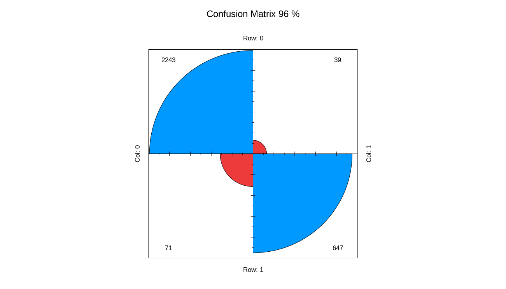

```{r setup, include=FALSE}
knitr::opts_chunk$set(echo = TRUE,eval = FALSE)
```

## Intro

The [fastai](https://github.com/fastai/fastai) library simplifies training fast and accurate neural nets using modern best practices. See the fastai website to get started. The library is based on research into deep learning best practices undertaken at ```fast.ai```, and includes "out of the box" support for ```vision```, ```text```, ```tabular```, and ```collab``` (collaborative filtering) models. 


## Tabular

Tabular data can be downloaded from [Kaggle](https://www.kaggle.com/jacksonchou/hr-data-for-analytics).
It is a basic binary classification case which contains both categorical and coninuous columns. Below one can see the structure of the dataset.

```
library(magrittr)
library(fastai)
df = data.table::fread('datasets_236694_503227_HR_comma_sep.csv')
str(df)
```

```
> str(df)
Classes ‘data.table’ and 'data.frame':	14999 obs. of  10 variables:
 $ satisfaction_level   : num  0.38 0.8 0.11 0.72 0.37 0.41 0.1 0.92 0.89 0.42 ...
 $ last_evaluation      : num  0.53 0.86 0.88 0.87 0.52 0.5 0.77 0.85 1 0.53 ...
 $ number_project       : int  2 5 7 5 2 2 6 5 5 2 ...
 $ average_montly_hours : int  157 262 272 223 159 153 247 259 224 142 ...
 $ time_spend_company   : int  3 6 4 5 3 3 4 5 5 3 ...
 $ Work_accident        : int  0 0 0 0 0 0 0 0 0 0 ...
 $ left                 : int  1 1 1 1 1 1 1 1 1 1 ...
 $ promotion_last_5years: int  0 0 0 0 0 0 0 0 0 0 ...
 $ sales                : chr  "sales" "sales" "sales" "sales" ...
 $ salary               : chr  "low" "medium" "medium" "low" ...
 - attr(*, ".internal.selfref")=<externalptr> 
```

Output column is ```left``` which is integer. Output has to be converted to character/factor.

```
df[['left']] = as.factor(df[['left']])
```

Later, we need to divide column names into 2 groups:

- Categorical columns
- Continuous columns

```
dep_var = 'left'
cat_names = c('sales', 'salary')
cont_names = c("satisfaction_level", "last_evaluation", "number_project",
               "average_montly_hours", "time_spend_company",
               "Work_accident", "promotion_last_5years")
```

Alternatively, it is easier to differentiate 2 types of columns (```integer/numeric``` vs. ```character/factor```) with ```dplyr::select_if(is.character)```.

Next step is to split data into 2 parts. However, we need to randomly select indices not rows because the latter will be done by ```tabular_learner```.

```
tot = 1:nrow(df)
tr_idx = sample(nrow(df), 0.8 * nrow(df))
ts_idx = tot[!tot %in% tr_idx]
```

The dataset can contain missing/large values. Therefore, ```fill missing``` and ```normalize``` functions from ```fastai``` can quickly handle these situations. 

```
procs = list(FillMissing(),Categorify(),Normalize())
```

In addition, filling missing values can be done in different ways:

- filling value by default is 0
- or it can be set to median 

## Dataloaders

Define data loaders and specify ```batch_size```, ```cat_names```, ```cont_names``` and etc:

```
dls = TabularDataTable(df, procs, cat_names, cont_names,
                       y_names = dep_var, splits = list(tr_idx, ts_idx) ) %>%
  dataloaders(bs = 50)
```

A deep learning model which contains embedding layers for categorical columns and linear for continuous ones. At the same time, define metrics:

```
model = dls %>% tabular_learner(layers=c(200,100,100,200),
                                config = tabular_config(embed_p = 0.3, use_bn = FALSE),
                                metrics = list(accuracy, RocAucBinary(),
                                             Precision(), Recall(),
                                             F1Score()))
```

```
> model
TabularModel(
  (embeds): ModuleList(
    (0): Embedding(11, 6)
    (1): Embedding(4, 3)
  )
  (emb_drop): Dropout(p=0.3, inplace=False)
  (bn_cont): BatchNorm1d(7, eps=1e-05, momentum=0.1, affine=True, track_running_stats=True)
  (layers): Sequential(
    (0): LinBnDrop(
      (0): Linear(in_features=16, out_features=200, bias=True)
      (1): ReLU(inplace=True)
    )
    (1): LinBnDrop(
      (0): Linear(in_features=200, out_features=100, bias=True)
      (1): ReLU(inplace=True)
    )
    (2): LinBnDrop(
      (0): Linear(in_features=100, out_features=100, bias=True)
      (1): ReLU(inplace=True)
    )
    (3): LinBnDrop(
      (0): Linear(in_features=100, out_features=200, bias=True)
      (1): ReLU(inplace=True)
    )
    (4): LinBnDrop(
      (0): Linear(in_features=200, out_features=2, bias=True)
    )
  )
)
```


Before fitting model find optimal learning rate:

```
model %>% lr_find()
# SuggestedLRs(lr_min=0.002754228748381138, lr_steep=1.5848931980144698e-06)

model %>% plot_lr_find()
```

<center>


</center>

## Fit

And finally, fit the model:

```
res = model %>% fit(5, lr = 0.005)
```

```
epoch     train_loss  valid_loss  accuracy  roc_auc_score  precision_score  recall_score
0         0.173383    0.189803    0.950333  0.969118       0.900000         0.893793   
1         0.151623    0.132094    0.960000  0.980776       0.924264         0.908966    
2         0.154831    0.118114    0.963333  0.984218       0.939914         0.906207   
3         0.149708    0.127625    0.958667  0.982307       0.916782         0.911724  
4         0.132304    0.103252    0.967667  0.986488       0.964497         0.899310  
```

Plot confusion matrix:

```
interp = ClassificationInterpretation_from_learner(model)

interp %>% plot_confusion_matrix(dpi = 90,figsize = c(6,6))
```

<center>



</center>

## Conclusion

Let's make predictions:

```
> model %>% predict(df[1000:1010,])
             0          1 classes
1  0.004488660 0.99551141       1
2  0.819206953 0.18079305       0
3  0.051526461 0.94847351       1
4  0.003814965 0.99618500       1
5  0.007526034 0.99247390       1
6  0.093833014 0.90616697       1
7  0.910625637 0.08937429       0
8  0.005479155 0.99452078       1
9  0.025799874 0.97420007       1
10 0.103506751 0.89649332       1
11 0.068529680 0.93147027       1
```


