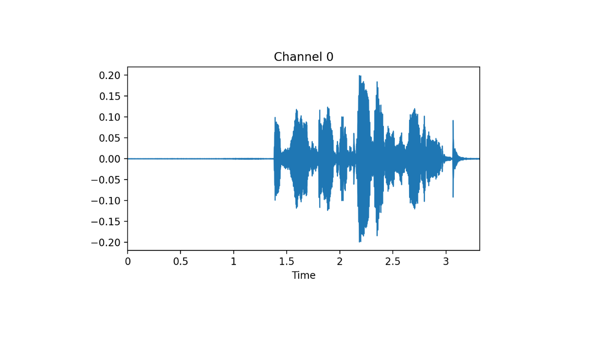

```{r setup, include=FALSE}
knitr::opts_chunk$set(echo = TRUE, eval = FALSE)
```

## Intro

First, we need to install ```fastaudio module```.

```
reticulate::py_install('fastaudio',pip = TRUE)
```


## Dataset

Grab data:

```{r}
URLs_SPEAKERS10()
path_dig = 'SPEAKERS10'
```


See audio extensions:

```{r}
audio_extensions()[1:6]
#[1] ".aif"  ".aifc" ".aiff" ".au"   ".m3u"  ".mp2" 
```

Read files:

```{r}
fnames = get_files(path_dig, extensions = audio_extensions())
# (#3842) [Path('SPEAKERS10/f0004_us_f0004_00414.wav')...]
```

## Visualize

Read audio data and visualize a tensor:

```{r}
at = AudioTensor_create(fnames[0])
at; at$shape
at %>% show() %>% plot(dpi = 200)
```

<center>



</center>


## Preparing the dataset

fastaudio has a AudioConfig class which allows us to prepare different settings for our dataset. Currently it has:

- BasicMelSpectrogram
- BasicMFCC
- BasicSpectrogram
- Voice

Voice module is the most suitable because it contains human voices.


```{r}
cfg = Voice()

cfg$f_max; cfg$sample_rate
#[1] 8000 # frequency range
#[1] 16000 # the sampling rate
```

Turn data into spectrogram and crop signal:

```{r}
aud2spec = AudioToSpec_from_cfg(cfg)

crop1s = ResizeSignal(1000)
```

Create a pipeline and see the result:

```{r}
pipe = Pipeline(list(AudioTensor_create, crop1s, aud2spec))
pipe(fnames[0]) %>% show() %>% plot(dpi = 200)
```

## Dataloader

As usual, prepare a datalaoder:

```{r}
item_tfms = list(ResizeSignal(1000), aud2spec)

get_y = function(x) substring(x$name[1],1,1)

aud_digit = DataBlock(blocks = list(AudioBlock(), CategoryBlock()),
                      get_items = get_audio_files,
                      splitter = RandomSplitter(),
                      item_tfms = item_tfms,
                      get_y = get_y)

dls = aud_digit %>% dataloaders(source = path_dig, bs = 64)

dls %>% show_batch(figsize = c(15, 8.5), nrows = 3, ncols = 3, max_n = 9, dpi = 180)
```

## Pretrained model

We will use a pretrained ResNet model. However, the channel number and weight dimension have to be changed:

```{r}
torch = torch()
nn = nn()

learn = Learner(dls, xresnet18(pretrained = FALSE), nn$CrossEntropyLoss(), metrics=accuracy)

# channel from 3 to 1
learn$model[0][0][['in_channels']] %f% 1L
# reshape
new_weight_shape <- torch$nn$parameter$Parameter(
  (learn$model[0][0]$weight %>% narrow('[:,1,:,:]'))$unsqueeze(1L))

# assign with %f%
learn$model[0][0][['weight']] %f% new_weight_shape
```

Find ```lr```:

```{r}
lrs = learn %>% lr_find()
#SuggestedLRs(lr_min=0.03019951581954956, lr_steep=0.0030199517495930195)
```

## Conclusion

And ```fit```:

```{r}
learn %>% fit_one_cycle(10, 1e-3)
```

```
epoch     train_loss  valid_loss  accuracy  time    
0         5.494162    3.295561    0.632812  00:06     
1         1.962470    0.236809    0.877604  00:06     
2         0.801965    0.174774    0.917969  00:06     
3         0.391742    0.208425    0.881510  00:06     
4         0.243276    0.149436    0.914062  00:06     
5         0.174708    0.134832    0.929688  00:07     
6         0.142626    0.127814    0.910156  00:06     
7         0.131042    0.120308    0.924479  00:07     
8         0.121679    0.126913    0.919271  00:06     
9         0.118215    0.114659    0.924479  00:06 
```


