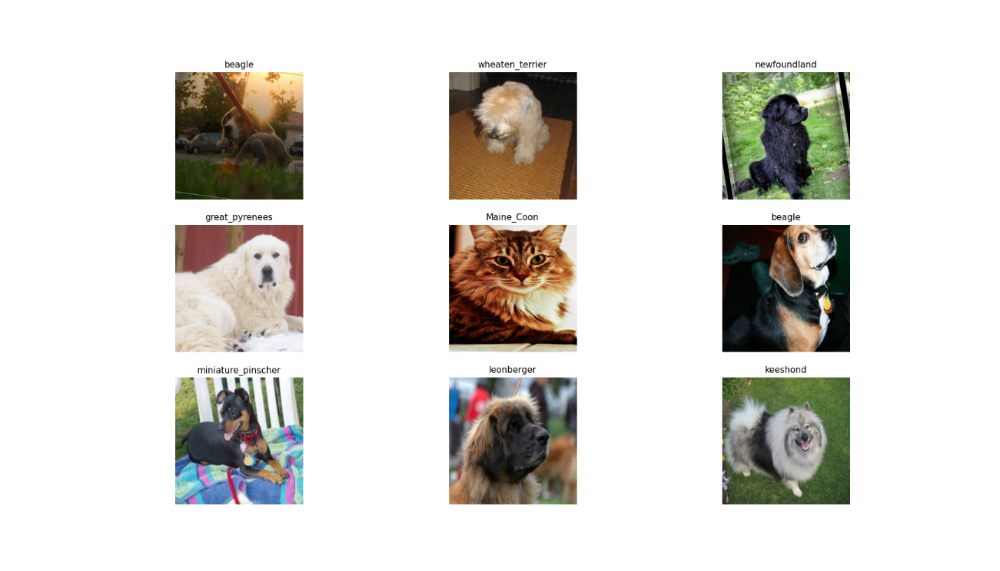

```{r setup, include=FALSE}
knitr::opts_chunk$set(echo = TRUE,eval = FALSE,echo = T)
```

## Intro

The [fastai](https://github.com/fastai/fastai) library simplifies training fast and accurate neural nets using modern best practices. See the fastai website to get started. The library is based on research into deep learning best practices undertaken at ```fast.ai```, and includes "out of the box" support for ```vision```, ```text```, ```tabular```, and ```collab``` (collaborative filtering) models. 


## Image data

Image dataset can be downloaded and extracted directly via the following function:

```{r}
URLs_PETS()
```

Later, we need to specify image folders and build a data loader object:

```{r}
path = 'oxford-iiit-pet'
path_anno = 'oxford-iiit-pet/annotations'
path_img = 'oxford-iiit-pet/images'
fnames = get_image_files(path_img)
```


## Dataloader

Data loader is one of the most important parts of the image classification part. Because here we apply different image transformations which can drastically improve the accuracy of the model.

```{r}
dls = ImageDataLoaders_from_name_re(
  path, fnames, pat='(.+)_\\d+.jpg$',
  item_tfms = RandomResizedCrop(460, min_scale=0.75), bs = 10,
  batch_tfms = list(aug_transforms(size = 299, max_warp = 0),
                  Normalize_from_stats( imagenet_stats() )
  ),
  device = 'cuda'
)
```

See batch:

```{r}
dls %>% show_batch()
```


<center>



</center>


## ResNet50

Let's load a pretrained ResNet50 model and construct a ```cnn_learner```:

```{r}
learn = cnn_learner(dls, resnet50(), metrics = error_rate)
```

```
Downloading: "https://download.pytorch.org/models/resnet50-19c8e357.pth" to /home/turgut/.cache/torch/hub/checkpoints/resnet50-19c8e357.pth
100%|██████████| 97.8M/97.8M [00:43<00:00, 2.36MB/s]
```

## Fit

It is time to fit the ResNet model:

```{r}
learn %>% fit_one_cycle(n_epoch = 8)
```

```
epoch     train_loss  valid_loss  error_rate  time    
0         0.741927    0.342162    0.103518    01:15     
1         0.713688    0.286085    0.100812    01:15     
2         0.594913    0.282628    0.088633    01:15     
3         0.441623    0.263180    0.085250    01:18     
4         0.354634    0.230228    0.077808    01:17     
5         0.200607    0.224293    0.071719    01:15     
6         0.154269    0.213939    0.062246    01:16     
7         0.127354    0.211825    0.064953    01:16 
```

Unfreeze the blocks and train again:

```{r}
learn$unfreeze()

learn %>% fit_one_cycle(3, lr_max = slice(1e-6,1e-4))
```

```
epoch     train_loss  valid_loss  error_rate  time    
0         0.162769    0.204167    0.061570    01:42     
1         0.168877    0.211312    0.071042    01:42     
2         0.178176    0.202088    0.062923    01:43 
```

Extraction of most confused:

```{r}
interp = ClassificationInterpretation_from_learner(learn)
interp %>% most_confused()
```

```
                           V1                         V2 V3
1   american_pit_bull_terrier staffordshire_bull_terrier 10
2                     Ragdoll                     Birman  6
3  staffordshire_bull_terrier  american_pit_bull_terrier  6
4                      Bengal                 Abyssinian  4
5                      Bengal               Egyptian_Mau  4
6                      Birman                    Ragdoll  4
7                Egyptian_Mau                     Bengal  3
8                       boxer           american_bulldog  3
9          miniature_pinscher  american_pit_bull_terrier  3
10 staffordshire_bull_terrier           american_bulldog  3
11          British_Shorthair               Russian_Blue  2
12                 Maine_Coon                    Ragdoll  2
13           american_bulldog staffordshire_bull_terrier  2
14                  chihuahua         miniature_pinscher  2
15                 Abyssinian               Russian_Blue  1
16                     Bengal                 Maine_Coon  1
17                     Birman                    Siamese  1
18                 Maine_Coon                     Bombay  1
19                    Persian                     Birman  1
20               Russian_Blue                 Abyssinian  1
21               Russian_Blue                     Bombay  1
22               Russian_Blue          British_Shorthair  1
23                    Siamese                     Birman  1
24           american_bulldog  american_pit_bull_terrier  1
25           american_bulldog                      boxer  1
26  american_pit_bull_terrier           american_bulldog  1
27  american_pit_bull_terrier         miniature_pinscher  1
28               basset_hound                     beagle  1
29               basset_hound         german_shorthaired  1
30               basset_hound                  shiba_inu  1
31                     beagle               basset_hound  1
32                      boxer         miniature_pinscher  1
33                  chihuahua                        pug  1
34                  chihuahua                    samoyed  1
35     english_cocker_spaniel             english_setter  1
36     english_cocker_spaniel                   havanese  1
37             english_setter                     beagle  1
38         german_shorthaired           american_bulldog  1
39             great_pyrenees                     beagle  1
40             great_pyrenees                    samoyed  1
41                   havanese           scottish_terrier  1
42              japanese_chin                    Ragdoll  1
43                   keeshond                 leonberger  1
44                 leonberger             great_pyrenees  1
45              saint_bernard           american_bulldog  1
46              saint_bernard                  chihuahua  1
47              saint_bernard             great_pyrenees  1
48              saint_bernard staffordshire_bull_terrier  1
49                    samoyed             great_pyrenees  1
50 staffordshire_bull_terrier               basset_hound  1
51 staffordshire_bull_terrier                     beagle  1
52            wheaten_terrier                   havanese  1
53          yorkshire_terrier           scottish_terrier  1
```

## Conclusion

And get predictions on new data. For this purpose, specify the name of the files:

```{r}
fls = list.files(paste(path,'images',sep = '/'),full.names = TRUE, recursive = TRUE)[c(250,500,700)]
fls

#[1] "oxford-iiit-pet/images/american_bulldog_142.jpg"          "oxford-iiit-pet/images/american_pit_bull_terrier_188.jpg"
#[3] "oxford-iiit-pet/images/basset_hound_188.jpg"      

result = learn %>% predict(fls)

```
