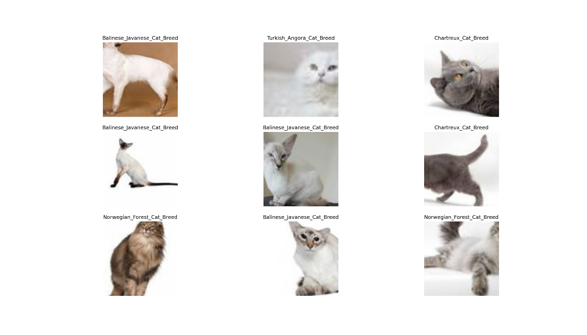

```{r setup, include=FALSE}
knitr::opts_chunk$set(echo = TRUE,eval = FALSE,echo = T)
```

## Intro

The [fastai](https://github.com/fastai/fastai) library simplifies training fast and accurate neural nets using modern best practices. See the fastai website to get started. The library is based on research into deep learning best practices undertaken at ```fast.ai```, and includes "out of the box" support for ```vision```, ```text```, ```tabular```, and ```collab``` (collaborative filtering) models. 


## Preparation

Via ```rvest``` package we can search and scrape any category of image.
Int this example we will classify 4 cat categories:

```{r}
# cat categories: https://www.purina.com/cats/cat-breeds
f_n = 'cats'

if(!dir.exists(f_n)) {
  dir.create(f_n)
}
```

A function to download cat images:

```{r}
library(rvest)

download_pet = function(name, dest) {
  query = name
  query = gsub('\\s', '%20', query)

  search <- read_html(paste("https://www.google.com/search?site=&tbm=isch&q", query, sep = "="))

  urls <- search %>% html_nodes("img") %>% html_attr("src") %>% .[-1]

  fixed_name = gsub('\\s|[[:punct:]]', '_', name)

  for (i in 1:length(urls)) {
    download.file(urls[i], destfile =
  file.path(dest,
      paste(
        paste(fixed_name,
              round(runif(1)*10000),
              sep = '_'),
        '.jpg', sep = ''
      )
    ), mode = 'wb'
    )
  }
}
```


## Get data

Lets define cat groups:

```{r}
cat_names = c('Balinese-Javanese Cat Breed', 'Chartreux Cat Breed', 
              'Norwegian Forest Cat Breed', 'Turkish Angora Cat Breed')
```

And iterate throught vector:

```{r}
for (i in 1:length(cat_names)) {
  download_pet(cat_names[i], f_n)
  print(paste('Done',cat_names[i]))
}
```

## Dataloaders

Call libraries and import dataset:

```{r}
library(fastai)
library(magrittr)

path = 'cats'
fnames = get_image_files(path)

fnames[1]
# cats/Turkish_Angora_Cat_Breed_8583.jpg
```

See batch:

```{r}
dls = ImageDataLoaders_from_name_re(
  path, fnames, pat='(.+)_\\d+.jpg$',
  item_tfms  = Resize(size = 200), bs = 15,
  batch_tfms = list(aug_transforms(size = 224, min_scale = 0.75),
                  Normalize_from_stats( imagenet_stats() )
  ),
  device = 'cuda', num_workers = 0L
)


dls %>% show_batch(dpi = 200)
```


<center>



</center>


## Fit model

Define ```cnn_learner``` and fit. But before that it is better to see the train metrics as well.

```{r}
learn = cnn_learner(dls, resnet50(), metrics = list(accuracy, error_rate))

learn$recorder$train_metrics = TRUE

```


```{r}
learn %>% fit_one_cycle(n_epoch = 5, 1e-3)
```

```
epoch     train_loss  train_accuracy  train_error_rate  valid_loss  valid_accuracy  valid_er_r
0         2.145128    0.333333        0.666667          1.205951    0.500000        0.500000  
1         1.480864    0.650000        0.350000          0.605784    0.812500        0.187500    
2         1.114904    0.850000        0.150000          0.353506    0.812500        0.187500   
3         0.858903    0.916667        0.083333          0.219998    0.875000        0.125000   
4         0.706619    0.933333        0.066667          0.231960    0.937500        0.062500   
```


## Conclusion

Predict random image:

```{r}
fnames[1]

# cats/Turkish_Angora_Cat_Breed_8583.jpg

learn %>% predict(as.character(fnames[1]))
```

```
$probabilities
Balinese_Javanese_Cat_Breed Chartreux_Cat_Breed Norwegian_Forest_Cat_Breed Turkish_Angora_Cat_Breed
1                 0.001805532         0.004121034                 0.09873049                0.8953429

$labels
[1] "Turkish_Angora_Cat_Breed"
```
