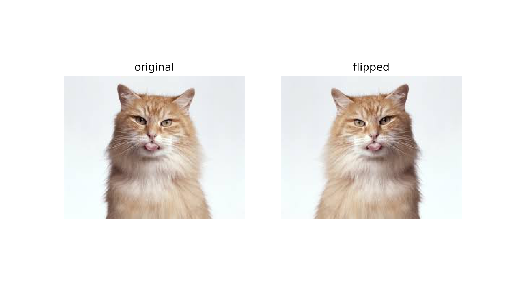
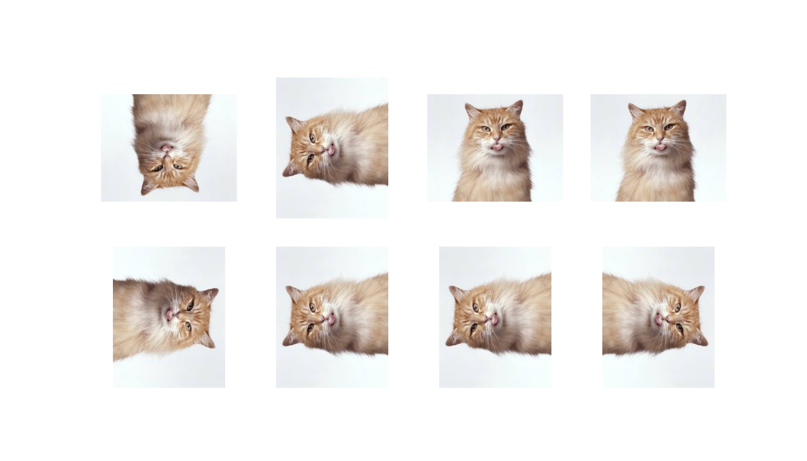
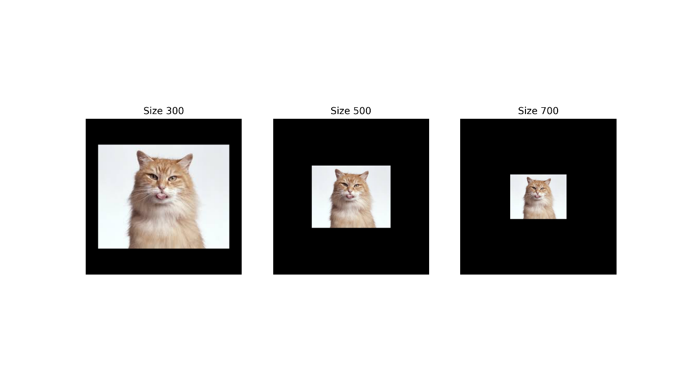
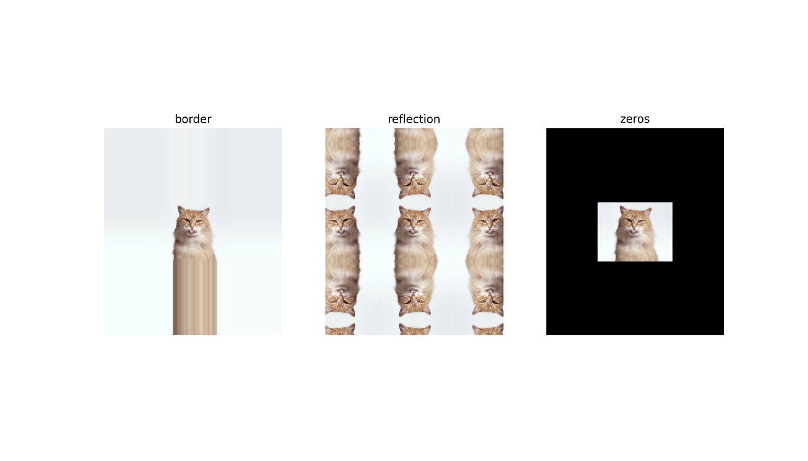
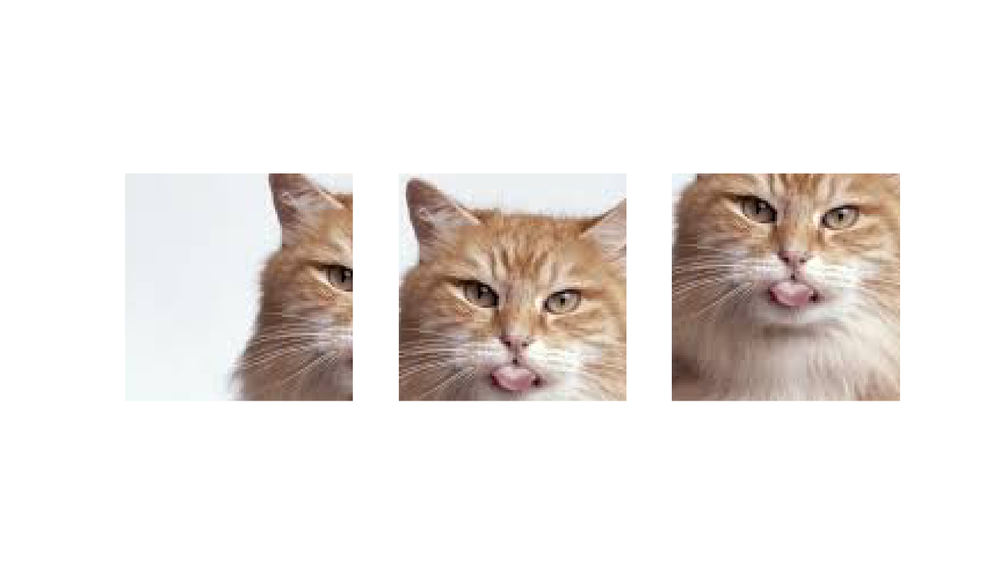
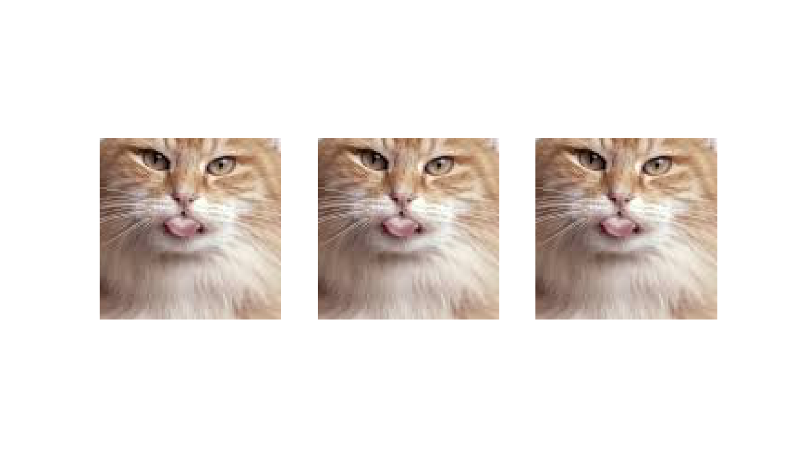
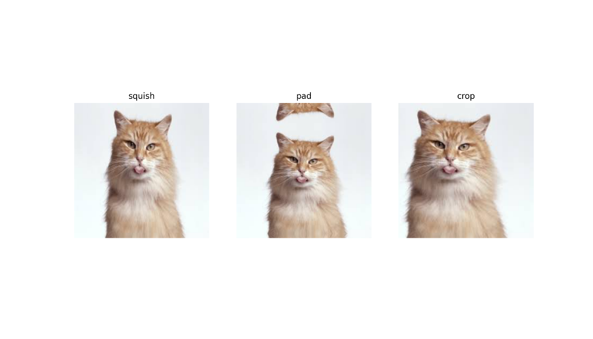
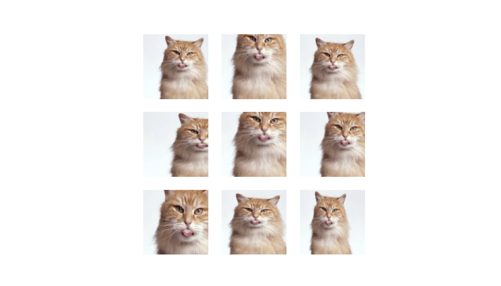

```{r setup, include=FALSE}
knitr::opts_chunk$set(echo = TRUE,eval = FALSE,echo = T)
```

## Intro

The [fastai](https://github.com/fastai/fastai) library simplifies training fast and accurate neural nets using modern best practices. See the fastai website to get started. The library is based on research into deep learning best practices undertaken at ```fast.ai```, and includes "out of the box" support for ```vision```, ```text```, ```tabular```, and ```collab``` (collaborative filtering) models. 


## Dataset

Data augmentation plays a huge role while working on Computer Vision task. Because the proper image transformation can drastically improve the generalization while building a deep learning model.

Read image:

```{r}
img = fastai::Image_create('files/cat.jpeg')
```

Plot it:

```{r}
img %>% show() %>% plot()
```


<center>


</center>


## Flipped


```{r}
img_res = list(img, img$flip_lr())
titles = c('original', 'flipped')

c(fig, axs) %<-% subplots(1,2)

for (i in 1:2) {
  img_res[[i]] %>% show_image(ax = axs[[i]],
               title=titles[i])
}

img %>% plot(dpi = 250)
```


<center>



</center>


## Dihedral

```{r}
c(fig, axs) %<-% subplots(2, 4)

for (i in 1:8) {
  show_image(DihedralItem(p = 1.)(img, split_idx = 0), ctx = axs[[i]])
}

img %>% plot(dpi = 250)
```


<center>



</center>


## CropPad


```{r}
sz = c(300L, 500L, 700L)
size = paste('Size', sz)

c(fig, axs) %<-% subplots(1, 3, figsize = c(12, 4))

for (i in 1:3) {
  show_image(img$crop_pad(sz[i]), ctx = axs[[i]], title = size[i])
}

img %>% plot(dpi = 250)
```


<center>



</center>


# PadModes

```{r}
pad_modes = c('border', 'reflection', 'zeros')

c(fig, axs) %<-% subplots(1, 3, figsize = c(12, 4))

for (i in 1:3) {
  show_image(img$crop_pad(c(600L,700L), pad_mode = pad_modes[i]),
             ctx = axs[[i]], title = pad_modes[i])
}

img %>% plot(dpi = 250)
```

<center>



</center>


## RandomCrop

```{r}
c(fig, axs) %<-% subplots(1, 3, figsize = c(12, 4))

ff = RandomCrop(100)

for (i in 1:3) {
  show_image(ff(img), ctx = axs[[i]])
}

img %>% plot(dpi = 250)
```

<center>



</center>


## CenterCrop

```{r}
c(fig, axs) %<-% subplots(1, 3, figsize = c(12, 4))

ff = RandomCrop(100L)

for (i in 1:3) {
  show_image(ff(img, split_idx = 1L), ctx = axs[[i]])
}

img %>% plot(dpi = 250)
```

<center>



</center>


## Resize method

```{r}
resize = c('squish', 'pad', 'crop')

c(fig, axs) %<-% subplots(1, 3, figsize = c(12, 4))

for (i in 1:3) {
  rsz = Resize(256, method = resize[i])
  show_image(rsz(img, split_idx = 0L), ctx = axs[[i]], title = resize[i])
}

img %>% plot(dpi = 250)
```


<center>



</center>


## RandomResizeCrop

```{r}
c(fig, axs) %<-% subplots(3, 3, figsize = c(9, 9))

ff = RandomResizedCrop(100)

for (i in 1:9) {
  show_image(ff(img), ctx = axs[[i]])
}

img %>% plot(dpi = 250)
```


<center>



</center>


