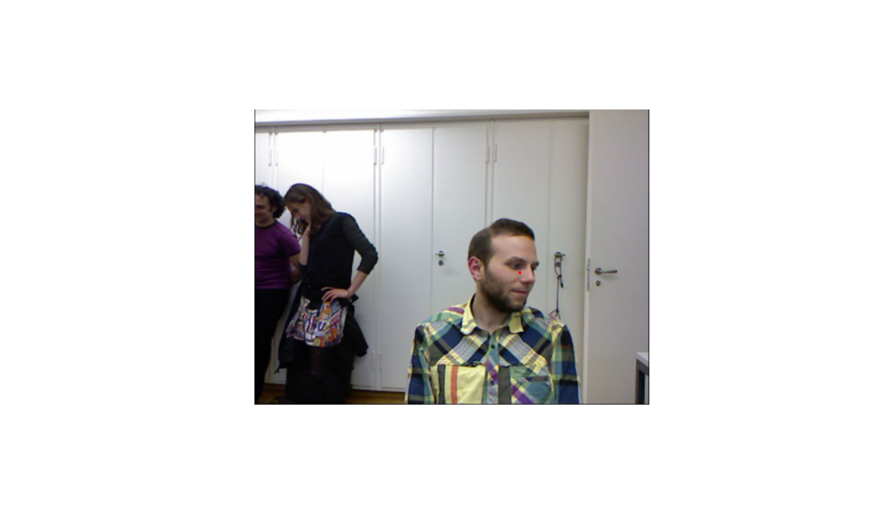

```{r setup, include=FALSE}
knitr::opts_chunk$set(echo = TRUE,eval = FALSE,echo = T)
```

## Intro

The [fastai](https://github.com/fastai/fastai) library simplifies training fast and accurate neural nets using modern best practices. See the fastai website to get started. The library is based on research into deep learning best practices undertaken at ```fast.ai```, and includes "out of the box" support for ```vision```, ```text```, ```tabular```, and ```collab``` (collaborative filtering) models. 

## Task
Our task is to find the center of the head in each image.

To achieve the goal, we need to do the following:

- upload images with ```DataBlock```
- add red points to the images

Upload an example:

```{r}
library(fastai)
library(magrittr)

path = 'biwi_head_pose'
fname = '09/frame_00667_rgb.jpg'

img = Image_create(paste(path,fname,sep = '/'))
img %>% show() %>% plot()
```

<center>


</center>


To add the points, we need to write simple functions:

```{r}
img2txt_name <- function(f) {
  paste(
    substr(f, 1, nchar(f)-7), 'pose.txt',
    sep = ''

  )
}

convert_biwi <- function(coords) {
  c1 = coords[1] * cal[1,][1]/coords[3] + cal[1,][3]
  c2 = coords[2] * cal[2,][2]/coords[3] + cal[2,][3]
  return(tensor(c1,c2))
}

get_ctr <- function(f) {
  # trick to make dataloaders work
  f = as.character(f)
  ctr = readr::read_lines(img2txt_name(f), skip = 4, n_max = 1) %>% trimws() %>%
    strsplit('\\s') %>% unlist() %>% as.numeric()
  convert_biwi(ctr)
}

get_ip <- function(img, pts) {
  TensorPoint_create(pts, img_size = img$size)
}
```

```{r}
ctr = readr::read_lines(img2txt_name(paste(path,fname,sep = '/')),
                        skip = 4, n_max = 1) %>% trimws() %>%
      strsplit('\\s') %>% unlist() %>% as.numeric()
```

Now, it is easier to add red points:

```{r}
ctr = get_ctr(paste(path,fname,sep = '/'))
ax = img %>% show(figsize = c(6, 6))
img %>% get_ip(ctr) %>% show(ctx = ax) %>% plot()
```

<center>



</center>

## Preparation

Prepare data laoder object and see batch:

```{r}
dblock = DataBlock(blocks = list(ImageBlock(), PointBlock()),
                   get_items = get_image_files(),
                   splitter = FuncSplitter(function(x) x$parent$name == '13'),
                   get_y = get_ctr,
                   batch_tfms = list(aug_transforms(size = c(120,160)),
                                     Normalize_from_stats(imagenet_stats()
                                                          )
                                     )
                   )

dls = dblock %>% dataloaders(path, path = path, bs = 64)

dls %>% show_batch(max_n = 9, figsize = c(9,6))
```

<center>


</center>

## Fit

Run for 5 epochs and see results:

```{r}
learn = cnn_learner(dls, resnet34())

learn %>% lr_find()

learn %>% plot_lr_find()

lr = 2e-2

learn %>% fit_one_cycle(5, slice(lr))
```

```{r}
learn %>% show_results(dpi = 200)
```

```
epoch     train_loss  valid_loss  time    
0         1.818259    0.861968    00:35     
1         0.222080    0.056300    00:34     
2         0.028511    0.012499    00:33     
3         0.017333    0.003378    00:33     
4         0.015135    0.004777    00:33 
```

<center>


</center>


