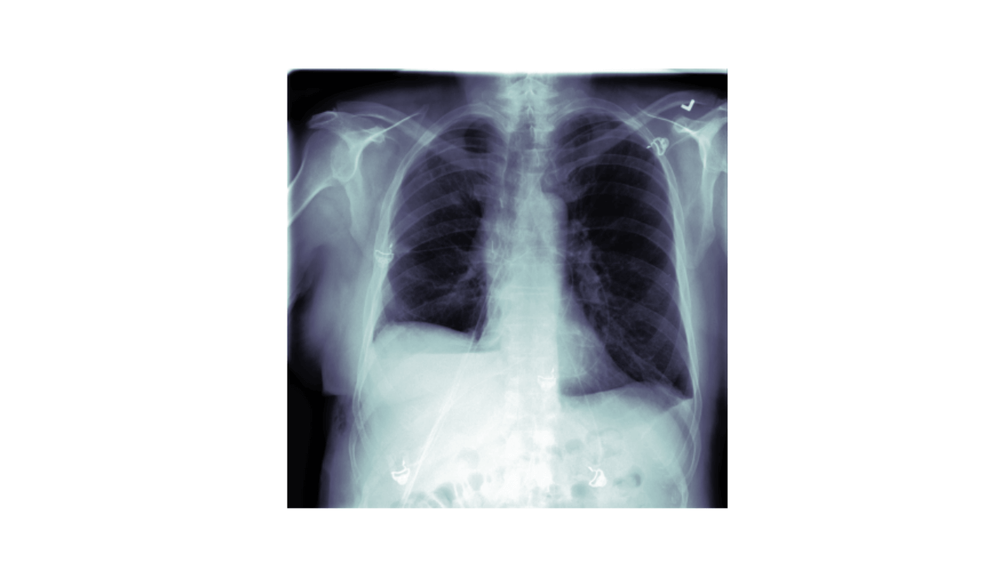
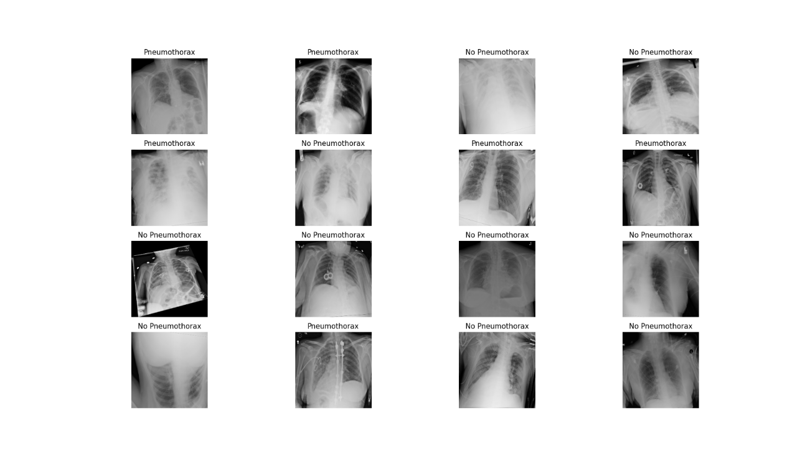
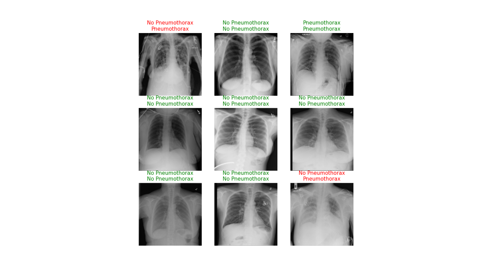

```{r setup, include=FALSE}
knitr::opts_chunk$set(echo = TRUE,eval = FALSE,echo = T)
```

## Intro

The [fastai](https://github.com/fastai/fastai) library simplifies training fast and accurate neural nets using modern best practices. See the fastai website to get started. The library is based on research into deep learning best practices undertaken at ```fast.ai```, and includes "out of the box" support for ```vision```, ```text```, ```tabular```, and ```collab``` (collaborative filtering) models. 


## Dataset

Download dataset:

```{r}
URLs_SIIM_SMALL()
```

Read example:

```{r}
library(fastai)
library(magrittr)
library(zeallot)

items = get_dicom_files("siim_small/train/")
items

c(trn,val) %<-% RandomSplitter()(items)

patient = 7
xray_sample = dcmread(items[patient])

xray_sample %>% show() %>% plot()
```


<center>



</center>


At the same time it is possible to gather the information from ```dcm``` files:

```{r}
# gather data
items_list = items$items

dicom_dataframe = data.frame()

for(i in 1:length(items_list)) {
  res = dcmread(as.character(items_list[[i]])) %>% to_matrix(matrix = FALSE)
  dicom_dataframe = dicom_dataframe %>% rbind(res)
  if(i %% 50 == 0) {
    print(i)
  }
}
```

Output:

```
[1] 50
[1] 100
[1] 150
[1] 200
[1] 250

> tibble::tibble(head(dicom_dataframe))
# A tibble: 6 x 42
  SpecificCharact… SOPClassUID SOPInstanceUID StudyDate StudyTime AccessionNumber Modality ConversionType
  <chr>            <chr>       <chr>              <int>     <dbl> <lgl>           <chr>    <chr>         
1 ISO_IR 100       1.2.840.10… 1.2.276.0.723…  19010101         0 NA              CR       WSD           
2 ISO_IR 100       1.2.840.10… 1.2.276.0.723…  19010101         0 NA              CR       WSD           
3 ISO_IR 100       1.2.840.10… 1.2.276.0.723…  19010101         0 NA              CR       WSD           
4 ISO_IR 100       1.2.840.10… 1.2.276.0.723…  19010101         0 NA              CR       WSD           
5 ISO_IR 100       1.2.840.10… 1.2.276.0.723…  19010101         0 NA              CR       WSD           
6 ISO_IR 100       1.2.840.10… 1.2.276.0.723…  19010101         0 NA              CR       WSD           
# … with 34 more variables: ReferringPhysicianName <lgl>, SeriesDescription <chr>, PatientName <chr>, PatientID <chr>,
#   PatientBirthDate <lgl>, PatientSex <chr>, PatientAge <int>, BodyPartExamined <chr>, ViewPosition <chr>,
#   StudyInstanceUID <chr>, SeriesInstanceUID <chr>, StudyID <lgl>, SeriesNumber <int>, InstanceNumber <int>,
#   PatientOrientation <lgl>, SamplesPerPixel <int>, PhotometricInterpretation <chr>, Rows <int>, Columns <int>,
#   PixelSpacing <dbl>, BitsAllocated <int>, BitsStored <int>, HighBit <int>, PixelRepresentation <int>,
#   LossyImageCompression <int>, LossyImageCompressionMethod <chr>, fname <chr>, MultiPixelSpacing <int>,
#   PixelSpacing1 <dbl>, img_min <int>, img_max <int>, img_mean <dbl>, img_std <dbl>, img_pct_window <dbl>
```

## Dataloader

Prepare dataloader and see batch:

```{r}
df = data.table::fread("siim_small/labels.csv")

pneumothorax = DataBlock(blocks = list(ImageBlock(cls = Dicom()), CategoryBlock()),
                         get_x = function(x) {paste('siim_small', x[[1]], sep = '/')},
                         get_y = function(x) {paste(x[[2]])},
                         batch_tfms = list(aug_transforms(size = 224),
                                           Normalize_from_stats( imagenet_stats() )
                         ))

dls = pneumothorax %>% dataloaders(as.matrix(df))

dls %>% show_batch(max_n = 16)
```


<center>



</center>


## Fit model

At first, construct model and print summary:

```{r}
learn = cnn_learner(dls, resnet34(), metrics = accuracy)
summary(learn)
```

```
Sequential (Input shape: ['64 x 3 x 224 x 224'])
================================================================
Layer (type)         Output Shape         Param #    Trainable 
================================================================
Conv2d               64 x 64 x 112 x 112  9,408      False     
________________________________________________________________
BatchNorm2d          64 x 64 x 112 x 112  128        True      
________________________________________________________________
ReLU                 64 x 64 x 112 x 112  0          False     
________________________________________________________________
MaxPool2d            64 x 64 x 56 x 56    0          False     
________________________________________________________________
Conv2d               64 x 64 x 56 x 56    36,864     False     
________________________________________________________________
BatchNorm2d          64 x 64 x 56 x 56    128        True      
________________________________________________________________
ReLU                 64 x 64 x 56 x 56    0          False     
________________________________________________________________
Conv2d               64 x 64 x 56 x 56    36,864     False     
________________________________________________________________
BatchNorm2d          64 x 64 x 56 x 56    128        True      
________________________________________________________________
Conv2d               64 x 64 x 56 x 56    36,864     False     
________________________________________________________________
BatchNorm2d          64 x 64 x 56 x 56    128        True      
________________________________________________________________
ReLU                 64 x 64 x 56 x 56    0          False     
________________________________________________________________
Conv2d               64 x 64 x 56 x 56    36,864     False     
________________________________________________________________
BatchNorm2d          64 x 64 x 56 x 56    128        True      
________________________________________________________________
Conv2d               64 x 64 x 56 x 56    36,864     False     
________________________________________________________________
BatchNorm2d          64 x 64 x 56 x 56    128        True      
________________________________________________________________
ReLU                 64 x 64 x 56 x 56    0          False     
________________________________________________________________
Conv2d               64 x 64 x 56 x 56    36,864     False     
________________________________________________________________
BatchNorm2d          64 x 64 x 56 x 56    128        True      
________________________________________________________________
Conv2d               64 x 128 x 28 x 28   73,728     False     
________________________________________________________________
BatchNorm2d          64 x 128 x 28 x 28   256        True      
________________________________________________________________
ReLU                 64 x 128 x 28 x 28   0          False     
________________________________________________________________
Conv2d               64 x 128 x 28 x 28   147,456    False     
________________________________________________________________
BatchNorm2d          64 x 128 x 28 x 28   256        True      
________________________________________________________________
Conv2d               64 x 128 x 28 x 28   8,192      False     
________________________________________________________________
BatchNorm2d          64 x 128 x 28 x 28   256        True      
________________________________________________________________
Conv2d               64 x 128 x 28 x 28   147,456    False     
________________________________________________________________
BatchNorm2d          64 x 128 x 28 x 28   256        True      
________________________________________________________________
ReLU                 64 x 128 x 28 x 28   0          False     
________________________________________________________________
Conv2d               64 x 128 x 28 x 28   147,456    False     
________________________________________________________________
BatchNorm2d          64 x 128 x 28 x 28   256        True      
________________________________________________________________
Conv2d               64 x 128 x 28 x 28   147,456    False     
________________________________________________________________
BatchNorm2d          64 x 128 x 28 x 28   256        True      
________________________________________________________________
ReLU                 64 x 128 x 28 x 28   0          False     
________________________________________________________________
Conv2d               64 x 128 x 28 x 28   147,456    False     
________________________________________________________________
BatchNorm2d          64 x 128 x 28 x 28   256        True      
________________________________________________________________
Conv2d               64 x 128 x 28 x 28   147,456    False     
________________________________________________________________
BatchNorm2d          64 x 128 x 28 x 28   256        True      
________________________________________________________________
ReLU                 64 x 128 x 28 x 28   0          False     
________________________________________________________________
Conv2d               64 x 128 x 28 x 28   147,456    False     
________________________________________________________________
BatchNorm2d          64 x 128 x 28 x 28   256        True      
________________________________________________________________
Conv2d               64 x 256 x 14 x 14   294,912    False     
________________________________________________________________
BatchNorm2d          64 x 256 x 14 x 14   512        True      
________________________________________________________________
ReLU                 64 x 256 x 14 x 14   0          False     
________________________________________________________________
Conv2d               64 x 256 x 14 x 14   589,824    False     
________________________________________________________________
BatchNorm2d          64 x 256 x 14 x 14   512        True      
________________________________________________________________
Conv2d               64 x 256 x 14 x 14   32,768     False     
________________________________________________________________
BatchNorm2d          64 x 256 x 14 x 14   512        True      
________________________________________________________________
Conv2d               64 x 256 x 14 x 14   589,824    False     
________________________________________________________________
BatchNorm2d          64 x 256 x 14 x 14   512        True      
________________________________________________________________
ReLU                 64 x 256 x 14 x 14   0          False     
________________________________________________________________
Conv2d               64 x 256 x 14 x 14   589,824    False     
________________________________________________________________
BatchNorm2d          64 x 256 x 14 x 14   512        True      
________________________________________________________________
Conv2d               64 x 256 x 14 x 14   589,824    False     
________________________________________________________________
BatchNorm2d          64 x 256 x 14 x 14   512        True      
________________________________________________________________
ReLU                 64 x 256 x 14 x 14   0          False     
________________________________________________________________
Conv2d               64 x 256 x 14 x 14   589,824    False     
________________________________________________________________
BatchNorm2d          64 x 256 x 14 x 14   512        True      
________________________________________________________________
Conv2d               64 x 256 x 14 x 14   589,824    False     
________________________________________________________________
BatchNorm2d          64 x 256 x 14 x 14   512        True      
________________________________________________________________
ReLU                 64 x 256 x 14 x 14   0          False     
________________________________________________________________
Conv2d               64 x 256 x 14 x 14   589,824    False     
________________________________________________________________
BatchNorm2d          64 x 256 x 14 x 14   512        True      
________________________________________________________________
Conv2d               64 x 256 x 14 x 14   589,824    False     
________________________________________________________________
BatchNorm2d          64 x 256 x 14 x 14   512        True      
________________________________________________________________
ReLU                 64 x 256 x 14 x 14   0          False     
________________________________________________________________
Conv2d               64 x 256 x 14 x 14   589,824    False     
________________________________________________________________
BatchNorm2d          64 x 256 x 14 x 14   512        True      
________________________________________________________________
Conv2d               64 x 256 x 14 x 14   589,824    False     
________________________________________________________________
BatchNorm2d          64 x 256 x 14 x 14   512        True      
________________________________________________________________
ReLU                 64 x 256 x 14 x 14   0          False     
________________________________________________________________
Conv2d               64 x 256 x 14 x 14   589,824    False     
________________________________________________________________
BatchNorm2d          64 x 256 x 14 x 14   512        True      
________________________________________________________________
Conv2d               64 x 512 x 7 x 7     1,179,648  False     
________________________________________________________________
BatchNorm2d          64 x 512 x 7 x 7     1,024      True      
________________________________________________________________
ReLU                 64 x 512 x 7 x 7     0          False     
________________________________________________________________
Conv2d               64 x 512 x 7 x 7     2,359,296  False     
________________________________________________________________
BatchNorm2d          64 x 512 x 7 x 7     1,024      True      
________________________________________________________________
Conv2d               64 x 512 x 7 x 7     131,072    False     
________________________________________________________________
BatchNorm2d          64 x 512 x 7 x 7     1,024      True      
________________________________________________________________
Conv2d               64 x 512 x 7 x 7     2,359,296  False     
________________________________________________________________
BatchNorm2d          64 x 512 x 7 x 7     1,024      True      
________________________________________________________________
ReLU                 64 x 512 x 7 x 7     0          False     
________________________________________________________________
Conv2d               64 x 512 x 7 x 7     2,359,296  False     
________________________________________________________________
BatchNorm2d          64 x 512 x 7 x 7     1,024      True      
________________________________________________________________
Conv2d               64 x 512 x 7 x 7     2,359,296  False     
________________________________________________________________
BatchNorm2d          64 x 512 x 7 x 7     1,024      True      
________________________________________________________________
ReLU                 64 x 512 x 7 x 7     0          False     
________________________________________________________________
Conv2d               64 x 512 x 7 x 7     2,359,296  False     
________________________________________________________________
BatchNorm2d          64 x 512 x 7 x 7     1,024      True      
________________________________________________________________
AdaptiveAvgPool2d    64 x 512 x 1 x 1     0          False     
________________________________________________________________
AdaptiveMaxPool2d    64 x 512 x 1 x 1     0          False     
________________________________________________________________
Flatten              64 x 1024            0          False     
________________________________________________________________
BatchNorm1d          64 x 1024            2,048      True      
________________________________________________________________
Dropout              64 x 1024            0          False     
________________________________________________________________
Linear               64 x 512             524,288    True      
________________________________________________________________
ReLU                 64 x 512             0          False     
________________________________________________________________
BatchNorm1d          64 x 512             1,024      True      
________________________________________________________________
Dropout              64 x 512             0          False     
________________________________________________________________
Linear               64 x 2               1,024      True      
________________________________________________________________

Total params: 21,813,056
Total trainable params: 545,408
Total non-trainable params: 21,267,648

Optimizer used: <function Adam at 0x7f2c8cd3b1e0>
Loss function: FlattenedLoss of CrossEntropyLoss()

Model frozen up to parameter group #2

Callbacks:
  - TrainEvalCallback
  - Recorder
  - ProgressCallback
```

Finally, fit the model:

```{r}
learn %>% fit_one_cycle(3)
```

```
epoch     train_loss  valid_loss  accuracy  time    
0         1.272695    0.905151    0.640000  00:02     
1         1.130290    0.811485    0.680000  00:02     
2         1.053936    0.748447    0.700000  00:02 
```

## Conclusion

```{r}
learn %>% show_results()
```

<center>



</center>

