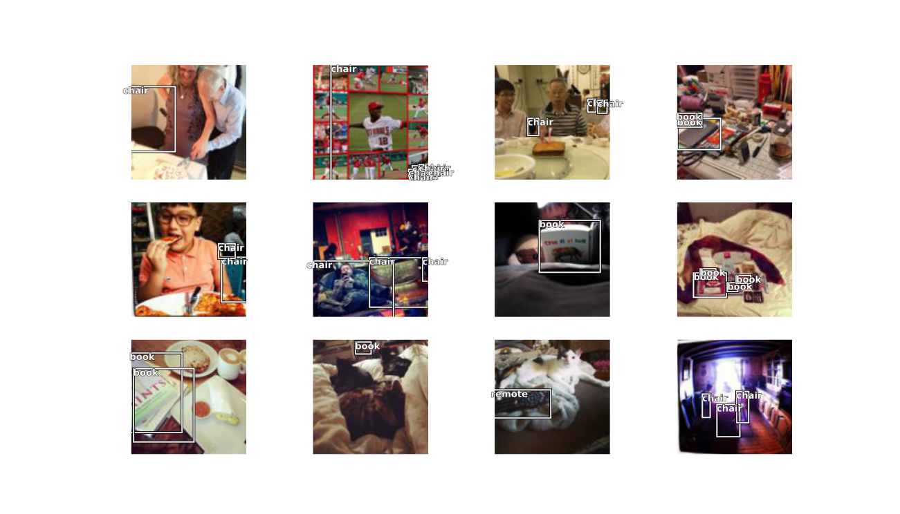

```{r setup, include=FALSE}
knitr::opts_chunk$set(echo = TRUE,eval = FALSE,echo = T)
```

## Intro

The [fastai](https://github.com/fastai/fastai) library simplifies training fast and accurate neural nets using modern best practices. See the fastai website to get started. The library is based on research into deep learning best practices undertaken at ```fast.ai```, and includes "out of the box" support for ```vision```, ```text```, ```tabular```, and ```collab``` (collaborative filtering) models. 

Original demo by [Zachary](https://github.com/muellerzr/Practical-Deep-Learning-for-Coders-2.0/blob/master/Computer%20Vision/06_Object_Detection.ipynb)

## Dataset

Grab data:


```{r}
URLs_COCO_TINY()
```


Read ```json``` file and get annotations:

```{r}
c(images, lbl_bbox) %<-% get_annotations('coco_tiny/train.json')

names(lbl_bbox) = images

img2bbox = lbl_bbox
```


## Dataloader

Prepare laoder object:

```{r}
get_y = list(function(o) img2bbox[[o$name]][[1]],
             function(o) as.list(img2bbox[[o$name]][[2]]))

coco = DataBlock(blocks = list(ImageBlock(), BBoxBlock(), BBoxLblBlock()),
                 get_items = get_image_files(),
                 splitter = RandomSplitter(),
                 get_y = get_y,
                 item_tfms = Resize(128),
                 batch_tfms = aug_transforms(),
                 n_inp = 1)

dls = coco %>% dataloaders('coco_tiny/train')
dls %>% show_batch(max_n = 12)
```


<center>



</center>


## RetinaNet

Build a model with RetinaNet components:

```{r}
encoder = create_body(resnet34(), pretrained = TRUE)

arch = RetinaNet(encoder, get_c(dls), final_bias=-4)

ratios = c(1/2,1,2)
scales = c(1,2**(-1/3), 2**(-2/3))

crit = RetinaNetFocalLoss(scales = scales, ratios = ratios)

nn = nn()

retinanet_split = function(m) {
  L(m$encoder,nn$Sequential(m$c5top6, m$p6top7, m$merges,
                       m$smoothers, m$classifier, m$box_regressor))$map(params())
}
```


## Fit

Unfreeze and train model:

```{r}
learn = Learner(dls, arch, loss_func = crit, splitter = retinanet_split)

learn$freeze()

learn %>% fit_one_cycle(10, slice(1e-5, 1e-4))
```

```
epoch     train_loss  valid_loss  time    
0         3.377425    3.352676    00:06     
1         3.304372    2.941969    00:03     
2         3.400184    2.811601    00:03     
3         3.239992    2.896531    00:03     
4         3.159638    3.090069    00:03     
5         3.117127    2.978687    00:03     
6         3.079744    2.832738    00:03     
7         3.035829    2.801513    00:03     
8         2.996779    2.798598    00:03     
9         2.962824    2.798002    00:03  
```

