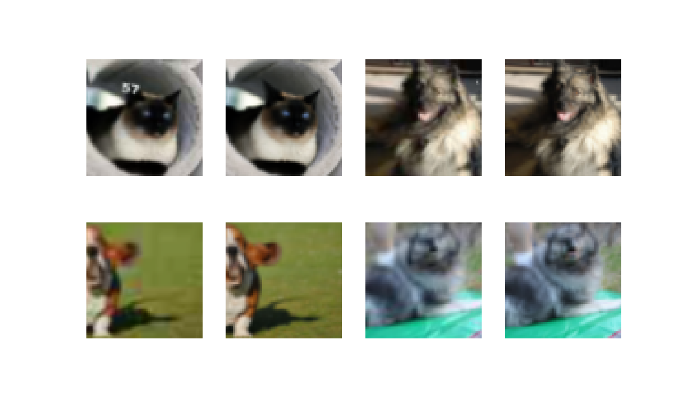
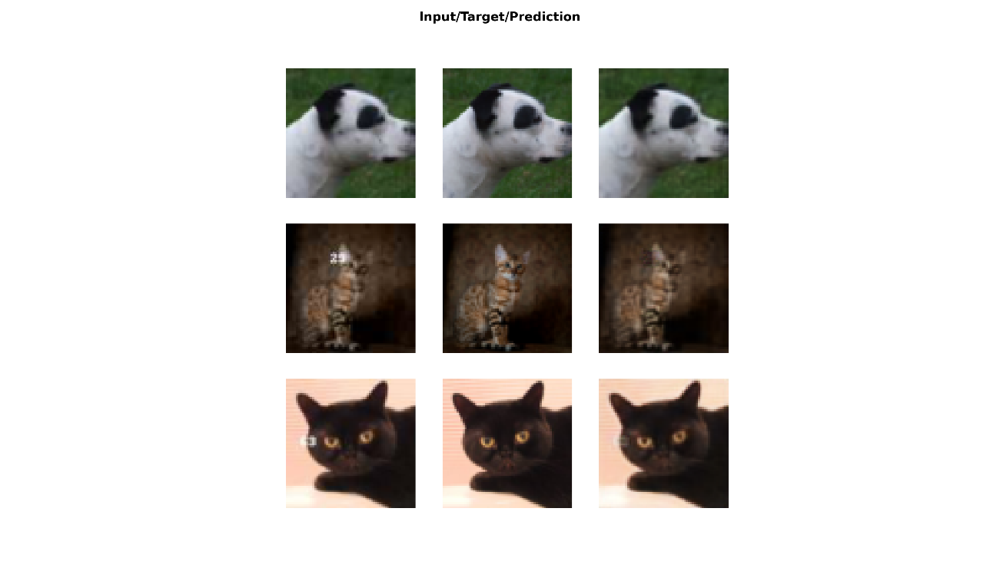

```{r setup, include=FALSE}
knitr::opts_chunk$set(echo = TRUE,eval = FALSE,echo = T)
```

## Intro

The [fastai](https://github.com/fastai/fastai) library simplifies training fast and accurate neural nets using modern best practices. See the fastai website to get started. The library is based on research into deep learning best practices undertaken at ```fast.ai```, and includes "out of the box" support for ```vision```, ```text```, ```tabular```, and ```collab``` (collaborative filtering) models.

## Dataset

Grab the pets dataset and Specify folders:

```{r}
URLs_PETS()

path = 'oxford-iiit-pet'
path_hr = paste(path, 'images', sep = '/')
path_lr = paste(path, 'crappy', sep = '/')
```

Prepare the input data by crappifying images:

```{r}
# run this only for the first time, then skip
items = get_image_files(path_hr)
parallel(crappifier(path_lr, path_hr), items)
```

## Parameters and dataloader

```{r}
bs = 10
size = 64
arch = resnet34()

get_dls = function(bs, size) {
  dblock = DataBlock(blocks = list(ImageBlock, ImageBlock),
                     get_items = get_image_files,
                     get_y = function(x) {paste(path_hr, as.character(x$name), sep = '/')},
                     splitter = RandomSplitter(),
                     item_tfms = Resize(size),
                     batch_tfms = list(
                       aug_transforms(max_zoom = 2.),
                       Normalize_from_stats( imagenet_stats() )
                     ))
  dls = dblock %>% dataloaders(path_lr, bs = bs, path = path)
  dls$c = 3L
  dls
}

dls_gen = get_dls(bs, size)
```

See batch:

```{r}
dls_gen %>% show_batch(max_n = 4, dpi = 150)
```

```
<center>



</center>
```

## Fit

Define loss function and create ```unet_learner```:

```{r}
wd = 1e-3

y_range = c(-3.,3.)

loss_gen = MSELossFlat()

create_gen_learner = function() {
  unet_learner(dls_gen, arch, loss_func = loss_gen,
               config = unet_config(blur=TRUE, norm_type = "Weight", 
               self_attention = TRUE, y_range = y_range))
}


learn_gen = create_gen_learner()

learn_gen %>% fit_one_cycle(2, pct_start = 0.8, wd = wd)
```

```
epoch     train_loss  valid_loss  time
0         0.025911    0.035153    00:42
1         0.019524    0.019408    00:39
```

## Conclusion

Plot results:

```{r}
learn_gen %>% show_results(max_n = 6, dpi = 200)
```


<center>



</center>


